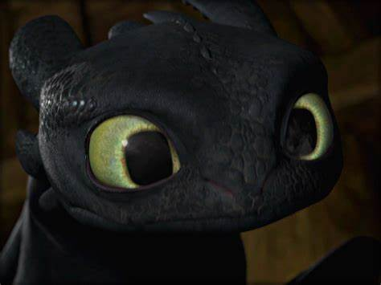

# Introduction
Hi! I'm Koo Song Le, a student in the Software Maintenance
and Evolution course.
I expect to learn a lot about modern software maintenance
practices and how to work with legacy systems.
- **Fun fact**: Fonts currently have a limitation of 2^2^2^2 = 65536 distinct characters that can be shown.
- **Course expectations**: To gain hands-on experience in maintaining and evolving software.
 <!-- Link to the uploaded image -->
## GitHub Profile
You can view my personalized GitHub profile [here](https://github.com/NKSL2001).